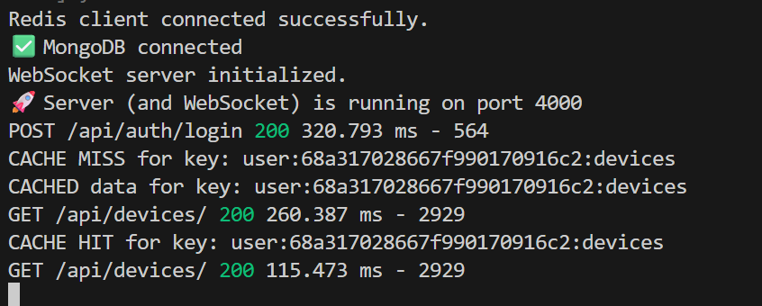
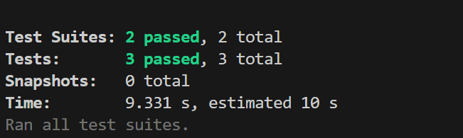
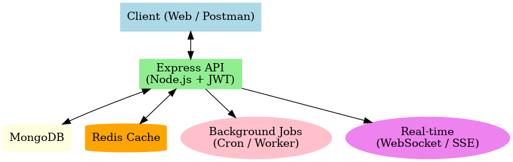

# Smart-Device-Management-Platform
This collection contains all the API endpoints for the Smart Device Management Platform.

This project is a robust backend service for a smart device management platform.It provides a complete set of APIs for user management, device control, data analytics, caching, real-time updates, and reporting — all built with a clean, scalable, and production-ready architecture.

---

## ✨ Features

* **Secure User Authentication**: Signup & login with JWTs. Implements **short-lived access tokens** (15 minutes) and **refresh tokens** (7 days) with token rotation and a blacklist mechanism.
* **Complete Device Management**: Full CRUD (Create, Read, Update, Delete) operations for smart devices, with ownership validation.
* **Real-time Device Monitoring**: WebSocket integration to broadcast device heartbeat events in real time to connected clients. Supports fallback via **SSE** and optimized polling.
* **Data Logging & Analytics**: Endpoints to log device events and retrieve aggregated usage data over time ranges. Expensive queries cached in Redis for 5 minutes. Optimized to handle **1000+ concurrent requests**.
* **Data Export & Reporting**: Export device logs as CSV/JSON and generate usage reports in JSON (chart-ready). Large exports are processed asynchronously with a job ID and status check. Email notification simulated via logs.
* **API Performance & Caching**: Redis caching layer for device listings & user data (TTL: 15–30 minutes). Cache invalidation on device updates. Device listing API responds in **<100ms** for cached results.
* **Automated Background Jobs**: A scheduled job runs hourly to automatically deactivate devices that have been inactive for more than 24 hours.
* **Robust Security**: Implements security headers, CORS configuration, per-endpoint rate limiting, and request logging with IP tracking.
* **Bonus Features**: Database indexes on frequently queried fields, connection pooling, structured error responses with error codes, health check endpoint, and a basic metrics endpoint.
* **Containerized Environment**: Fully Dockerized with Docker Compose for a consistent, one-command setup process.

---

## 🛠️ Tech Stack

* **Backend**: Node.js, Express.js  
* **Database**: MongoDB with Mongoose ODM  
* **Caching**: Redis  
* **Authentication**: JSON Web Tokens (JWT - Access + Refresh Tokens)  
* **Real-Time**: WebSocket / SSE  
* **Validation**: Joi  
* **Containerization**: Docker & Docker Compose  
* **Testing**: Jest & Supertest  

---

## 🚀 Getting Started

You can run this project either locally on your machine or using the provided Docker setup. Docker is the recommended method.

### Prerequisites

* Node.js (v18 or newer)  
* npm  
* MongoDB (if running locally)  
* Redis (for caching)  
* Docker Desktop (if using Docker)  

### 1. Local Setup

1. **Clone the repository:**
    ```bash
    git clone <your-repository-url>
    cd smart-device-management
    ```

2. **Install dependencies:**
    ```bash
    npm install
    ```

3. **Set up environment variables:**
    Create a `.env` file in the project root. Copy the contents of `.env.example` and fill in your specific details:
    ```env
    PORT=4000
    MONGO_URI="your-mongodb-connection-string"
    JWT_SECRET="your-access-secret"
    JWT_EXPIRES_IN="15m"
    JWT_REFRESH_SECRET="your-refresh-secret"
    JWT_REFRESH_EXPIRES_IN="7d"
    REDIS_URL="redis://localhost:6379"
    ```

4. **Start the server:**
    ```bash
    npm run dev
    ```
    The server will be running on `http://localhost:4000`.

### 2. Docker Setup (Recommended)

1. **Ensure Docker is running.**

2. **Build and run the containers:**
    ```bash
    docker-compose up --build
    ```

3. The API will be available at `http://localhost:4000`.

---

## 📄 API Documentation

A complete and detailed API specification is provided via the Postman collection.

* **File:** You can find the collection file in the root of this repository: `Smart-Device-Management.postman_collection.json`.  
* **Public Link:** You can also view the documentation online at the following public link:  
  [**View Postman Documentation**](https://documenter.getpostman.com/view/40691244/2sB3BHnUov)

### API Endpoint Overview

| Feature             | Endpoint                       | Method | Protected |
| ------------------- | ------------------------------ | ------ | --------- |
| **User Management** | `/api/auth/signup`             | `POST` | No        |
|                     | `/api/auth/login`              | `POST` | No        |
|                     | `/api/auth/refresh`            | `POST` | No        |
|                     | `/api/auth/logout`             | `POST` | Yes       |
| **Device Management** | `/api/devices`               | `POST` | Yes       |
|                     | `/api/devices`                 | `GET`  | Yes       |
|                     | `/api/devices/:id`             | `PATCH`| Yes       |
|                     | `/api/devices/:id`             | `DELETE`| Yes      |
|                     | `/api/devices/:id/heartbeat`   | `POST` | Yes       |
| **Real-Time**       | `/api/devices/subscribe`       | WS/SSE | Yes       |
| **Data & Analytics**| `/api/devices/:id/logs`        | `POST` | Yes       |
|                     | `/api/devices/:id/logs`        | `GET`  | Yes       |
|                     | `/api/devices/:id/usage`       | `GET`  | Yes       |
| **Reporting**       | `/api/export/logs`             | `POST` | Yes       |
|                     | `/api/export/logs/:jobId/status`| `GET` | Yes       |

---

## 📦 Deliverables

1. **Working Application**  
   * Complete source code on GitHub  
   * All features functional and tested  
   * Docker Compose setup for easy local testing  

2. **Documentation**  
   * Updated README with new features  
   * API documentation for all new endpoints  
   * Performance benchmarks for caching improvements  
   * Architecture diagram (`/screenshot/architecture.png`)  

3. **Testing Evidence**  
   * Unit tests for core business logic  
   * Integration tests for new API endpoints  
   * Performance test results or screenshots  
   * Postman collection with example requests  

---

## 📊 Performance Benchmarks

* Device listing API: **<100ms** for cached results  
* Analytics endpoints: support **1000+ concurrent requests**  
* Export jobs: processed asynchronously with job tracking  



---

## ✅ Testing Evidence

* **Tests Results**  
  


## 🏗️ Architecture Overview



---

## 🤔 Assumptions Made

* The default role for any new user signing up is **"user"**.  
* The background job to deactivate inactive devices runs **once every hour**.  
* The `units_consumed` event is the primary event type used for the usage aggregation endpoint.  
* Large exports are asynchronous with job polling.  
* Email notifications are simulated in logs.  
